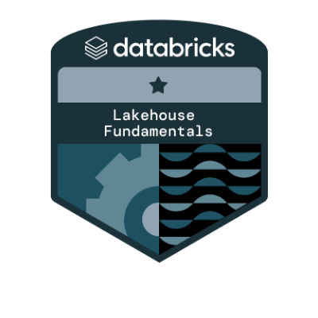

### Oi eu sou Michel Maia | Hi I'm Michel Maia 👋

Em outubro de 2021 tomei uma das melhores decisões da minha vida, troquei 12 anos de experiência na área da Segurança Privada, por uma transição de carreira na tecnologia. Atualmente sou estudante de Análise e Desenvolvimento de Sistemas na faculdade Anhanguera. 

In October 2021 I made one of the best decisions of my life, I traded 12 years of experience in the area of Private Security for a career transition in technology. I am currently a Systems Analysis and Development student at Anhanguera College. 

<!--

  

-->

- 🌱 Atualmente estou aprendendo SQL e Python. I’m currently learning SQL e Python
- 📗 Atualmente estou lendo. Dentes de dragão, Michael Crichton
- 📫 Como me encontrar. How to reach me: 
   

 

  
  
  
  
  
   

 
 
  
  

  <a href="https://github.com/michel-maia">
  
  
  
    

## 

 

